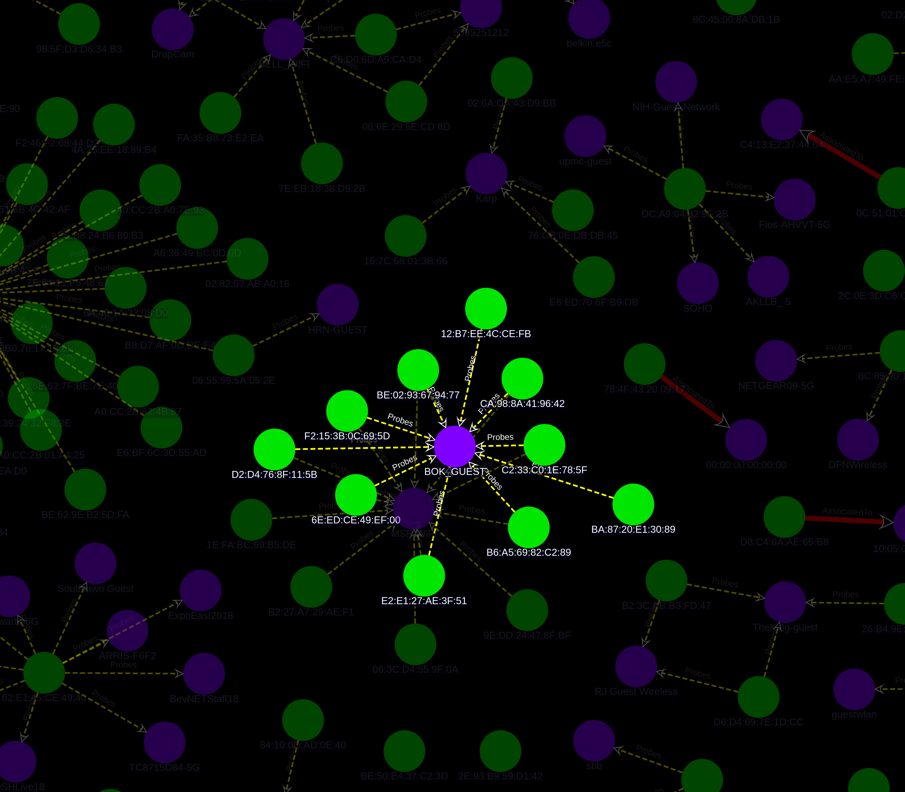

# BEACONGRAPH (v0.1)


## Description
BeaconGraph is an interactive tool that visualizes client and Access Point relationships. Inspired by [airgraph-ng](https://github.com/aircrack-ng/aircrack-ng/tree/master/scripts/airgraph-ng) and [Bloodhound](https://github.com/BloodHoundAD/BloodHound), BeaconGraph aims to support wireless security auditing. It is written in Python with GUI support by [pywebview](https://github.com/r0x0r/pywebview) and a [Neo4j](https://github.com/neo4j/neo4j) backend.

## Prerequisites

- Python >=3.6
- Neo4j

**Tested Platforms:** Linux<br>
Note: OSX and Windows should be supported but not have been tested yet

## Acceptable CSV Formats
- airodump-ng

## Usage

```
./beaconGraph.py <airodump CSV file>
```

`--no-flush`: Do NOT delete current database before adding new entries<br>
`--manuf`: Update the Wireshark OUI Lookup file

NOTE: The larger the neo4j database, the more time it'll take to process. During testing, some large databases (over 2000 clients and access points combined) took over 10 minutes to render on screen.

## Screenshots




## Things To Do
- Verify all encryption types display properly (WEP/WPA)
- Clean up and separate code from one file
- Create wiki
- Package binaries for Windows/Linux/OSX
- Add Kismet CSV support


