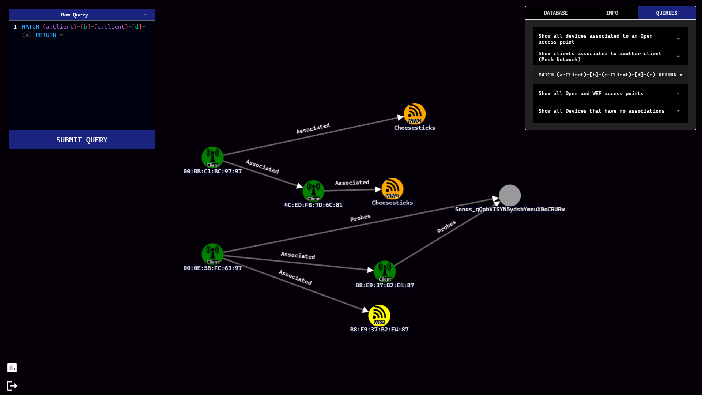

# BEACONGRAPH (v0.69)

<p align='center'></p>

## Description

BeaconGraph is an interactive tool that visualizes client and Access Point relationships. Inspired by [airgraph-ng](https://github.com/aircrack-ng/aircrack-ng/tree/master/scripts/airgraph-ng) and [Bloodhound](https://github.com/BloodHoundAD/BloodHound), BeaconGraph aims to support wireless security auditing. The frontend is written in Vue and the backend in Python 3.8. Data is parsed into a [Neo4j](https://github.com/neo4j/neo4j) database.

# Installation

## With Docker

Most users may find it easier to install Beacongraph via Docker. This is the recommended method.

```
git clone https://github.com/daddycocoaman/BeaconGraph
docker-compose up
```

The `docker-compose` file will create three containers:

- Frontend
- Backend
- Neo4j v4

By default, the BeaconGraph container will expose the UI on port 9091. The neo4j container will expose neo4j on ports 7474 (HTTP), and 7687 (Bolt). You may initially interact directly with the neo4j interface on port 7474.

**Note**: Currently, BeaconGraph only supports running these containers locally. Attempting to upload to the frontend hosted remotely will be unsuccessful but this behavior is expected to change in the future.

The default credentials for neo4j are: **neo4j/password**. You can change this in the `docker-compose` file via the NEO4JAUTH environment variable.

## Screenshots


