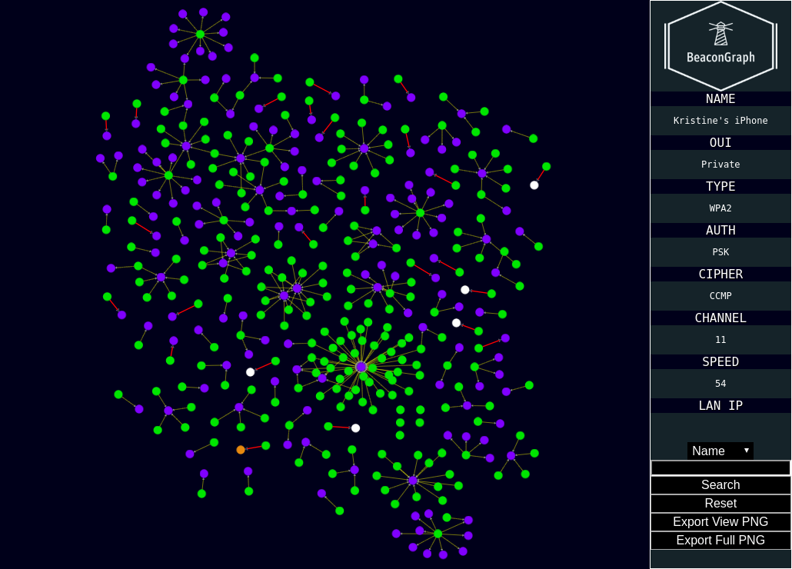

# BEACONGRAPH (v0.69)

<p align='center'></p>

## Description
BeaconGraph is an interactive tool that visualizes client and Access Point relationships. Inspired by [airgraph-ng](https://github.com/aircrack-ng/aircrack-ng/tree/master/scripts/airgraph-ng) and [Bloodhound](https://github.com/BloodHoundAD/BloodHound), BeaconGraph aims to support wireless security auditing. It is written in Python 3.7 using [Dash](https://dash.plot.ly/)  and a [Neo4j](https://github.com/neo4j/neo4j) backend. Dash has a [cytoscape.js](https://github.com/cytoscape/cytoscape.js) implementation and is served by Flask.

## Prerequisites

- Python >= 3.7
- Neo4j

Python 3.7 version is important, as some functionality will not work with older versions.

## Installation

Because PyQt5 versions change a lot in their minor versions, it is highly recommended that you run BeaconGraph in its own virtual environment in order to avoid interference with existing packages.
```
pipenv --python 3.7
pipenv shell
pip3 install -r requirements.txt
```

## Acceptable CSV Formats
- airodump-ng

## Usage

```
python3.7 BeaconGraph.py
```

## Screenshots
