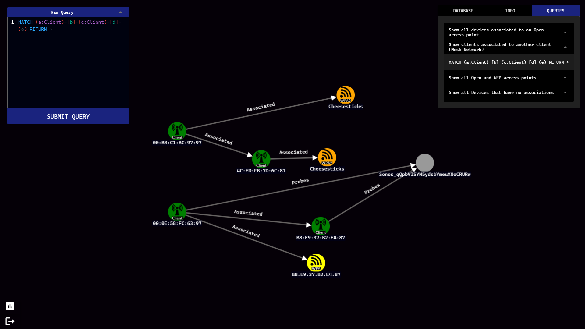

# BEACONGRAPH (v1.0.0-beta)


## Description

BeaconGraph is an interactive tool that visualizes client and Access Point relationships. Inspired by [airgraph-ng](https://github.com/aircrack-ng/aircrack-ng/tree/master/scripts/airgraph-ng) and [Bloodhound](https://github.com/BloodHoundAD/BloodHound), BeaconGraph aims to support wireless security auditing. The frontend is written in Vue and the backend in Python 3.8. Data is parsed into a [Neo4j](https://github.com/neo4j/neo4j) database.

## Installation

## With Docker

Most users may find it easier to install Beacongraph via Docker. This is the recommended method.

```bash
git clone https://github.com/daddycocoaman/BeaconGraph
docker-compose up
```

The `docker-compose` file will create three containers:

- Frontend
- Backend
- Neo4j v4

By default, the BeaconGraph container will expose the UI on port 9091. The neo4j container will expose neo4j on ports 7474 (HTTP), and 7687 (Bolt). You may initially interact directly with the neo4j interface on port 7474.

**Note**: Currently, BeaconGraph only supports running these containers locally. Attempting to upload to the frontend hosted remotely will be unsuccessful but this behavior is expected to change in the future.

The default credentials for neo4j are: **neo4j/password**. You can change this in the `docker-compose` file via the NEO4JAUTH environment variable.

## Usage

Once logged in, you are able to upload data using the "Upload Data" widget. Currently only `airodump-ng` output is supported. After the data is ingested, you can query the database using [Cypher](https://neo4j.com/developer/cypher/intro-cypher/) language. Example queries are available in the Queries tab.

To remove previously ingested data from the UI, use the `Clear Ingested Data` button in the `Database` tab. If you want to remove Neo4j data at the container level, `docker compose down -v` will also clear the database volume created by Docker.

## Cypher Quick Start

BeaconGraph uses Neo4j's Cypher query language. A simple way to teach it is to think in three steps:

1. `MATCH` a graph pattern.
2. Optionally use `WHERE` to filter labels or properties.
3. `RETURN` the nodes or relationships you want drawn.

Useful patterns:

- `MATCH (n) RETURN n LIMIT 25`
- `MATCH (n:Open) RETURN n`
- `MATCH (c:Client)-[r:Probes]->(d:Device) RETURN c, r, d`
- `MATCH (c:Client)-[r]->(d:Device) RETURN c, r, d`
- `MATCH (n) WHERE n.Name CONTAINS "wifi" RETURN n LIMIT 50`
- `MATCH (a) WHERE NOT (a)-[:Probes|Associated]->() RETURN a`

The `Queries` tab in the UI now includes a short primer plus worked examples that students can copy into the `Raw Query` panel and modify.

## Screenshots



## Bugs

- You may recieve an error or "no results found" if you try to query before an upload of data has finished processing. This should disappear once the ingestion is complete.
